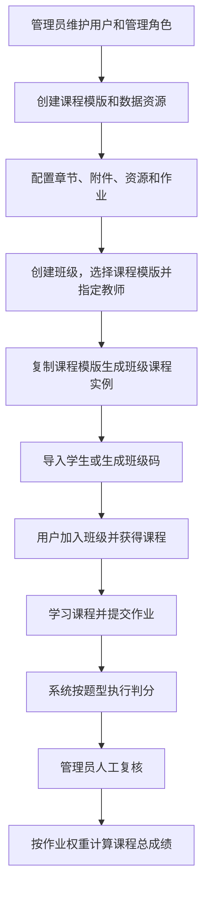

# 数智社科实训平台业务流程

> 本文档是业务对象、流程、状态和规则的权威来源。页面范围、布局、信息展示与交互入口见[《页面概况》](页面概况.md)。

## 1. 产品定位

数智社科实训平台面向线下实训教学，提供课程学习、数据资源、线上作业、智能判分、人工复核和成绩管理能力。

| 平台 | 使用对象 | 主要用途 |
|---|---|---|
| 客户端 | 所有个人用户 | 加入班级、学习课程、完成作业、查看成绩、使用数据资源 |
| 管理端 | 拥有管理角色的个人用户 | 管理用户、权限、课程、资源、班级、作业和成绩 |

## 2. 核心业务对象

| 对象 | 说明 |
|---|---|
| 用户 | 平台统一账号，可作为学生、班级教师或平台管理员 |
| 管理角色 | 管理端 RBAC 权限集合 |
| 课程模版 | 可复用的课程内容，修改后直接保存 |
| 班级 | 成员与课程学习的组织主体 |
| 课程实例 | 创建班级时从课程模版复制，可独立修改或重新导入 |
| 数据资源 | 按目录组织的数据文件，可绑定到课程的节 |
| 作业 | 每节可配置零或一份，由若干道必答题组成 |

```text
课程模版 ── 创建班级时复制 ──> 班级课程实例
                                  ├── 班级成员
                                  ├── 学习记录
                                  ├── 作业提交
                                  ├── 批改结果
                                  └── 课程成绩

数据资源目录
└── 末级目录
    └── 数据资源 ── 绑定 ──> 课程的节
```

## 3. 整体业务流程



## 4. 账号与权限

### 4.1 账号流程

```text
填写手机号、验证码和密码
→ 完成注册
→ 系统生成用户名
→ 登录客户端
```

- 密码登录支持用户名、手机号或邮箱；
- 验证码登录和忘记密码支持手机号或邮箱验证；
- 用户可分别绑定或修改手机号、邮箱，并可修改密码；
- 绑定或修改手机号、邮箱统一分为两步：先验证当前账号，再验证并绑定新的手机号或邮箱；
- 当前账号验证仅使用账号已绑定的联系方式；手机号和邮箱均已绑定时，用户可自行切换验证方式并接收对应验证码；
- 当前账号验证通过后才可进入第二步；新手机号或邮箱通过验证码校验后，系统保存新的绑定关系；
- 用户资料包括学院、专业、班级、学号、姓名和注册时间；
- 管理员可新增、批量导入、查询、编辑、启停和删除平台用户。

### 4.2 RBAC 权限

```text
用户
└── 管理角色
    └── 功能权限
        └── 管理端模块
            ├── 页面访问
            └── 页面内操作
```

- 用户可分配一个或多个管理角色；
- 用户拥有的功能权限取其全部管理角色权限的并集；
- 用户只显示有权访问的菜单和操作；
- 页面内操作权限依赖对应模块的查看权限：授予操作权限时同时授予查看权限，取消查看权限时同时取消该模块的其他操作权限；
- 当前权限只控制管理端功能，不配置按学院、班级或个人划分的数据范围，也不设置角色继承关系；
- 班级管理权限统一由平台管理角色授予；
- 班级成员仅分为教师和学生；
- 教师身份本身不附带管理权限。

管理端功能权限按当前页面和业务操作划分：

| 模块 | 功能权限 |
|---|---|
| 用户列表 | 查看用户、新增用户、导入用户、编辑用户、分配角色、调整用户状态、删除用户 |
| 角色与权限 | 查看角色、新增角色、编辑角色、配置权限、删除角色 |
| 课程模板 | 查看课程模板、新增课程模板、复制课程模板、编辑基础信息、维护课程内容、配置作业、删除课程模板 |
| 数据资源 | 查看数据资源、维护资源目录、新增数据资源、导入数据资源、编辑数据资源、上传资源文件、移动数据资源、删除数据资源 |
| 班级管理 | 查看班级、新增班级、编辑班级、调整班级状态、删除班级、查看成员、管理成员、生成班级码、查看课程实例、编辑课程实例、重新导入模板、查看作业提交、批改作业、查看成绩、导出成绩 |
| 平台设置 | 查看模型配置、编辑模型配置、测试模型连接 |

其中，“维护课程内容”包含章节、本节说明、课程附件与数据资源绑定的维护；“管理成员”包含导入学生和移出班级成员；“批改作业”包含人工复核、确认批改和打回重做。课程管理员若需要在课程中选择数据资源，除课程模板相关权限外，还需要“查看数据资源”权限。

### 4.3 平台配置

平台配置当前仅维护智能体所需的大模型连接配置，不包含其他系统参数或业务规则配置。

## 5. 课程与资源准备

### 5.1 课程结构

```text
课程
├── 标题、描述、封面
└── 章
    └── 节
        ├── 节标题、节描述
        ├── 本节说明（富文本）
        ├── 课程附件
        ├── 数据资源
        └── 作业（零或一份）
            └── 题目
                ├── 题目标题
                ├── 题目描述（可选富文本）
                └── 题型对应配置
```

- 课程固定为章、节两层；
- 章仅用于逻辑分组，节是具体学习单元；
- 节描述用于简要概括当前学习单元的目标或内容；
- 本节说明使用富文本，承载教学内容、操作步骤和作业要求等；
- 课程附件可包含 PPT、文档、数据和代码等；
- 一个节可绑定若干数据资源。

### 5.2 课程模版与课程实例

管理员创建并维护课程模版。创建班级时，系统复制课程模版的章节、节描述、说明、附件、数据资源绑定和作业，生成独立课程实例。

- 课程模版修改后直接保存；
- 已有课程实例不会自动同步模版修改；
- 课程实例可独立修改，不影响模版和其他班级；
- 课程实例可主动重新导入当前课程模版。

### 5.3 数据资源

- 资源目录最多四层；
- 只有末级目录可以存放数据资源；
- 数据资源必须属于一个末级目录；
- 资源包含名称、英文名、描述、标签、字段说明、CSV 样例和 ZIP 数据；
- 资源标签使用可增删改的列表维护，每个标签可单独选择展示颜色；
- 字段说明由字段、英文名和说明组成；
- 客户端可查看字段、预览或下载样例，并下载完整数据。

## 6. 班级与成员

### 6.1 创建班级

```text
填写班级信息
→ 选择课程模版
→ 指定唯一教师
→ 创建班级
→ 生成课程实例
→ 教师自动加入班级
```

一个班级绑定一个课程实例，并且有且只有一名教师。教师的成员身份不改变其平台管理权限；教师同时拥有与学生一致的课程学习能力，并记录学习进度。

### 6.2 加入班级

#### 管理员导入

```text
管理员选择或批量导入平台用户
→ 系统校验用户
→ 用户直接成为班级学生
```

#### 班级码加入

```text
管理员手动生成班级码
→ 班级码在 30 分钟内有效
→ 用户在客户端输入班级码
→ 校验通过后直接加入班级
```

### 6.3 班级管理

拥有相应平台权限的管理员可以：

- 查看、导入和移出成员；
- 生成班级码；
- 编辑课程实例或重新导入课程模版；
- 查看作业提交、人工复核和打回重做；
- 查看和导出班级成绩。

## 7. 课程学习与作业

教师自动加入班级或用户以学生身份加入班级后，均自动获得该班级课程实例的学习权限并记录学习进度。

```text
加入班级
→ 获得班级课程
→ 按章、节学习内容
→ 查看附件和数据资源
→ 完成本节学习
→ 完成在线作业
→ 查看批改结果和课程成绩
```

学习记录、作业提交、批改结果和成绩均归属于具体班级课程实例，不同班级之间相互独立。

### 7.1 作业规则

- 一个节有零或一份作业；
- 作业不单独维护名称，展示名称由所在节标题生成；
- 题目数量由题目列表自动统计，不单独维护；
- 所有题目均为必答题；
- 每道题必须设置题目标题，可选设置富文本题目描述；
- 每道题单独设置分值；
- 每份作业的题目分值总和必须为 100 分；
- 每份作业单独设置课程成绩权重；
- 一门课程所有作业权重总和必须为 100%；
- 分值或权重不满足要求时可以保存，但不能完成课程配置；
- 作业不设置开始时间和结束时间；
- 用户可保存草稿，提交时必须完成全部题目。

### 7.2 题型与判分

| 题型 | 作答方式 | 判分流程 |
|---|---|---|
| 单选题 | 选择一个选项 | 自动判分 |
| 多选题 | 选择多个选项 | 自动判分 |
| 判断题 | 选择正确或错误 | 自动判分 |
| 填空题 | 填写一个或多个空 | 自动判分 → 人工复核 |
| 简答题 | 输入文本 | 智能辅助判分 → 人工复核 |
| 实践题 | 上传附件 | 智能辅助判分 → 人工复核 |

箭头表示严格的先后顺序，组合中的每个环节均需执行。

- 单选题、多选题、判断题、填空题使用标准答案；
- 简答题、实践题使用富文本参考答案；
- 实践题可包含题目附件。

### 7.3 作业状态

| 状态 | 说明 |
|---|---|
| 未完成 | 尚未提交或已被打回重做 |
| 智能判分中 | 已提交，系统正在判分 |
| 待复核 | 系统判分完成，等待人工复核 |
| 已完成 | 判分流程已经完成 |

用户提交后自动触发对应判分流程。管理员可确认复核结果或打回重做；打回后保留历史提交，用户可以重新提交。

客户端在线作业目录将“未完成”进一步细分展示：尚未开始或被打回后尚未继续作答时显示“待完成”，已经产生当前草稿时显示“答题中”。提交后的目录状态依次使用“智能判分中”“待复核”“已完成”。

## 8. 成绩计算

每份作业满分为 100 分，课程总成绩按作业权重加权计算：

```text
课程总成绩 = Σ（作业得分 × 作业权重）
```

成绩明细记录每份作业的得分、权重、加权得分和状态，只有当前有效的批改结果参与计算。

## 9. 课程修改与记录处理

修改班级课程实例前，如果已经产生学习、提交或批改数据，系统必须统计影响范围并提示操作者。

| 修改内容 | 处理结果 |
|---|---|
| 课程标题、封面、章标题、节标题或章/节排序 | 学习、提交和批改记录保留 |
| 节描述、本节说明或课程附件 | 对应节学习记录作废，作业提交和批改保留 |
| 题目标题、题目描述、题目附件、选项或题目分值 | 对应作业提交和批改作废，重新计算成绩 |
| 标准答案、参考答案或评分标准 | 作业提交保留，批改结果作废，重新触发判分 |
| 作业权重 | 提交和批改保留，重新计算课程总成绩 |
| 删除节或作业 | 对应学习、提交、批改和成绩记录作废 |

重新导入课程模版视为对课程实例的整体覆盖。执行前必须展示内容差异、受影响成员和记录，并进行二次确认。
